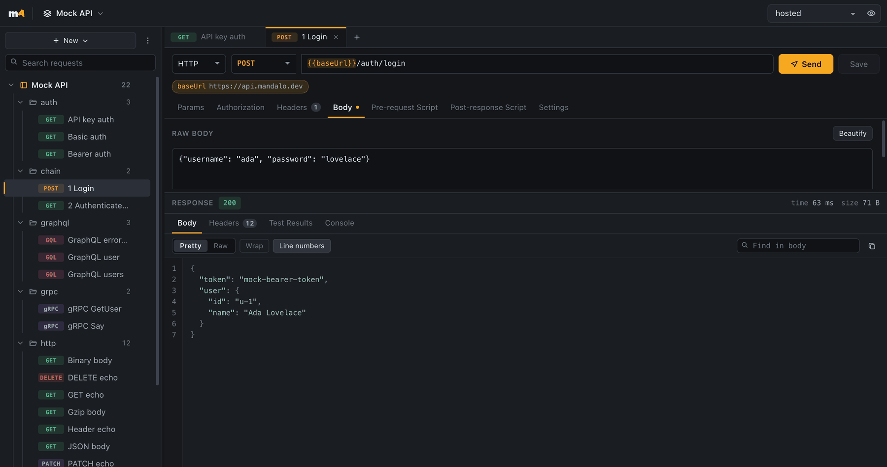
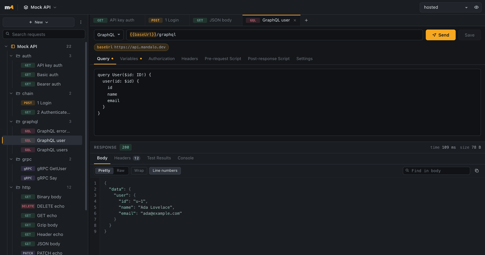
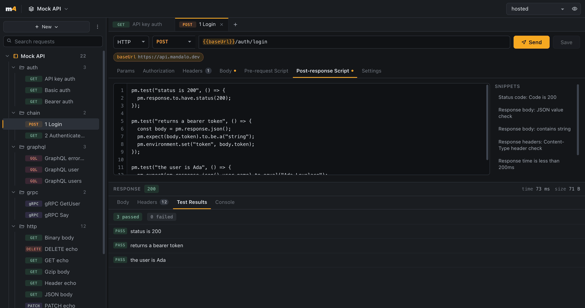

# Mándalo

*¡Mándalo!* — send it. A fast, offline, git-native API client. Postman without the bloat, the account, or the cloud.

<p align="center">
  
</p>

<p align="center">
  
  &nbsp;
  
</p>

## Why

- **Offline, no account** — everything on your machine. No sign-in, no telemetry.
- **Git-native** — [`.http`](docs/http-format.md), [`.grpc`](docs/grpc-format.md), [`.ws` / `.mqtt`](docs/stream-formats.md) and TOML environments. Diff them, review them, PR them.
- **Open by URL** — any public repo of those files is a collection. `mandalo open owner/name`, or [browse read-only](docs/remote-collections.md).
- **Import what you have** — [OpenAPI / Swagger](docs/openapi-import.md) or [Postman](docs/postman-compatibility.md); compromises are reported, never swallowed.
- **HTTP · GraphQL · gRPC · WebSocket · SSE · MQTT** — one workbench, one CLI.
- **CI-ready** — same engine as `mandalo run` with pretty / JSON / JUnit reporters and secret scanning.

## Install

All three ship from every [GitHub release](https://github.com/De-Rus/mandalo/releases/latest):

| | |
| --- | --- |
| **Desktop** | macOS `.dmg`, Windows `.msi` / setup, Linux `.AppImage` / `.deb`. Auto-updates from published releases. |
| **CLI** | `curl -fsSL https://mandalo.dev/install.sh \| sh` |
| **VS Code / Cursor** | `.vsix` on the release → `code --install-extension mandalo-<platform>-0.2.0.vsix` |

macOS Gatekeeper will refuse the unsigned `.dmg` until you clear quarantine (or build from source). Check `SHA256SUMS` first:

```bash
xattr -d com.apple.quarantine ~/Downloads/mandalo_*.dmg
```

## Try it

```bash
git clone https://github.com/De-Rus/mandalo
mandalo --workspace mandalo/examples/mock-workspace run mock --env hosted
```

Or open `examples/mock-workspace` / `examples/petstore` in the desktop app. Local mock: `make mock-api` and `--env local`.

## CLI

```bash
mandalo init ./my-api --name "Acme API"
mandalo run api --env staging --reporter junit > results.xml
mandalo send api auth/login.http#0 --env staging
mandalo open acme/collections              # public repo, read-only
mandalo listen wss://stream.example.com/socket
mandalo scan --staged                      # credential guard
```

Secrets and shared env values: see [docs/workspace.md](docs/workspace.md). Full CLI surface: `mandalo --help`.

## Develop

```bash
pnpm install && pnpm tauri dev
cargo test --workspace && pnpm test
```

Stack: Tauri 2 · Rust (`mandalo-core`) · React 19. Docs live under [`docs/`](docs/).

## License

MIT — see [LICENSE](LICENSE).
